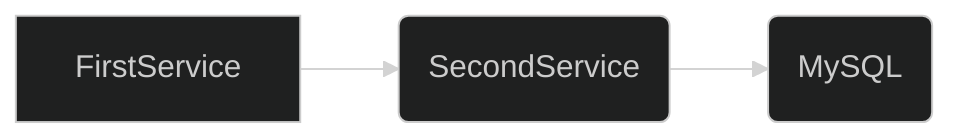
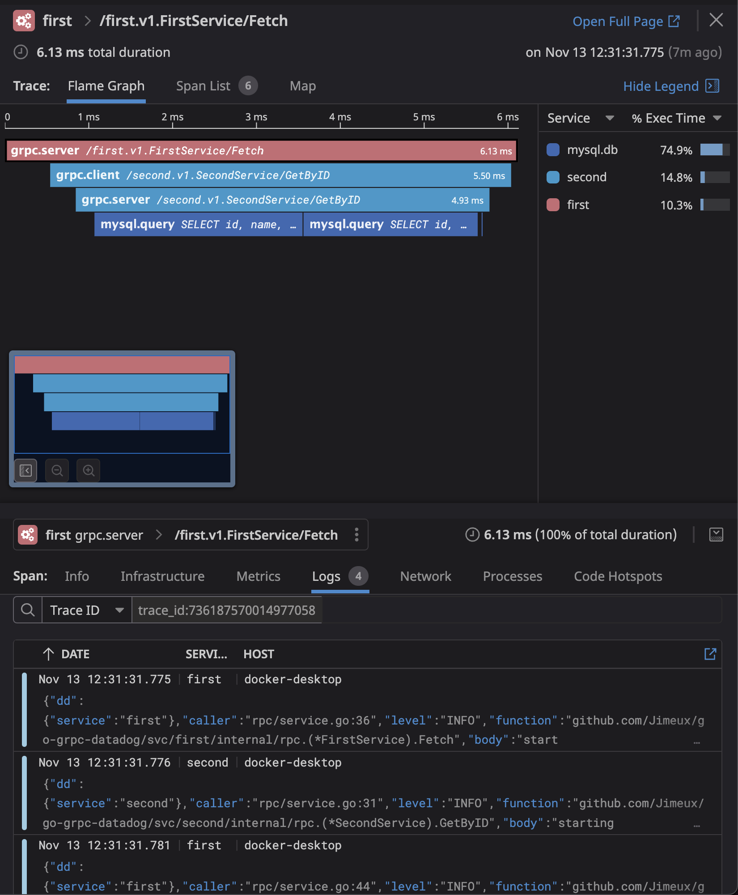

# go-grpc-datadog

### A simple DataDog observability demonstration with two gRPC services and a database.

## Features

- Health checks with `google.golang.org/grpc/health/grpc_health_v1`
- Server reflection with `google.golang.org/grpc/reflection`
- Chained interceptors with `github.com/grpc-ecosystem/go-grpc-middleware`
  - Includes panic recovery middleware
- Graceful shutdown
- Observability
  - Distributed tracing, profiling & metrics with `gopkg.in/DataDog/dd-trace-go.v1`
  - Logging with `go.uber.org/zap` and the DataDog agent
  - All data correlated on DataDog

## Setup

1. Run `make gen`
2. Set `DD_API_KEY` in `.env`
3. Run `docker-compose up`
4. Run services
   - Terminal 1: `cd svc/second && go run main.go`
   - Terminal 2: `cd svc/first && go run main.go`
 

